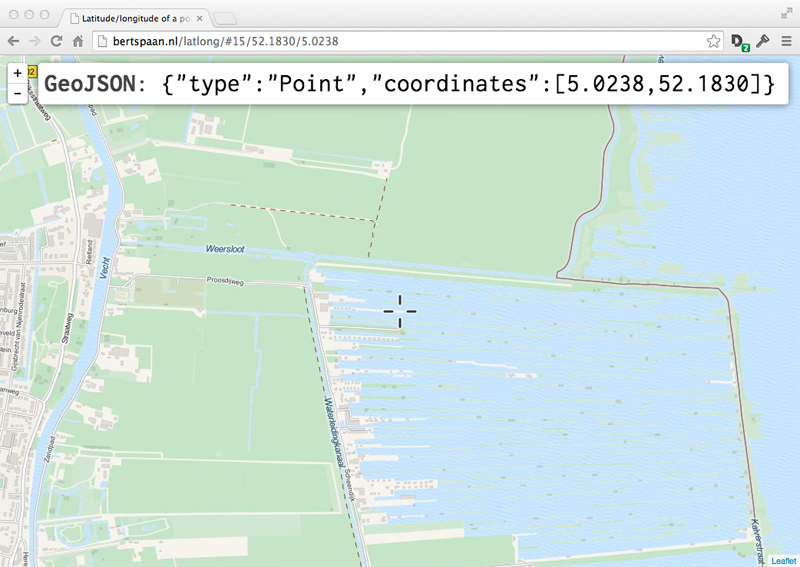

# Latlong

Easily find the latitude and longitude of a point!

## Templates

- Latitude, longitude
- Well-known text
- PostGIS
- GeoJSON

Add more by editing [`templates.json`](https://github.com/bertspaan/latlong/blob/gh-pages/templates.json)!
