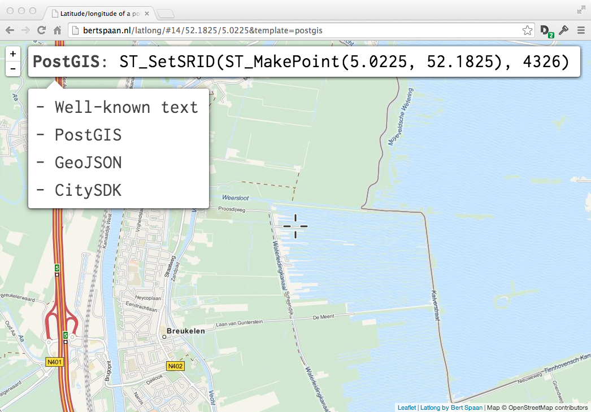

# Latlong

Easily find latitude and lotitude of a point!

## Templates

- Latitude, longitude
- Well-known text
- PostGIS
- GeoJSON
- [CitySDK](http://dev.citysdk.waag.org)

Add more by editing [`templates.json`](https://github.com/bertspaan/latlong/blob/gh-pages/templates.json)!